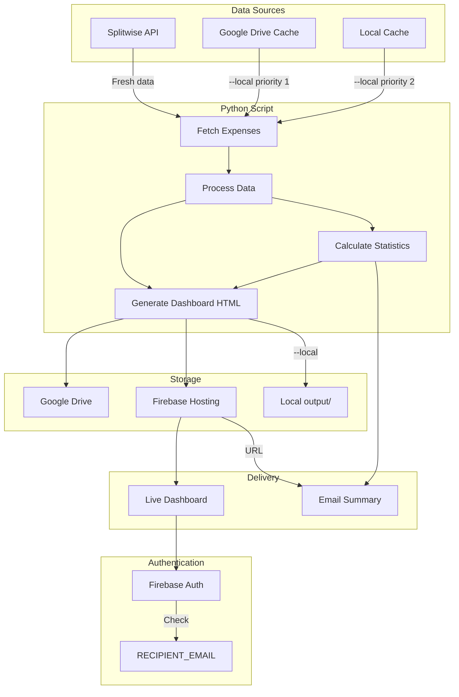
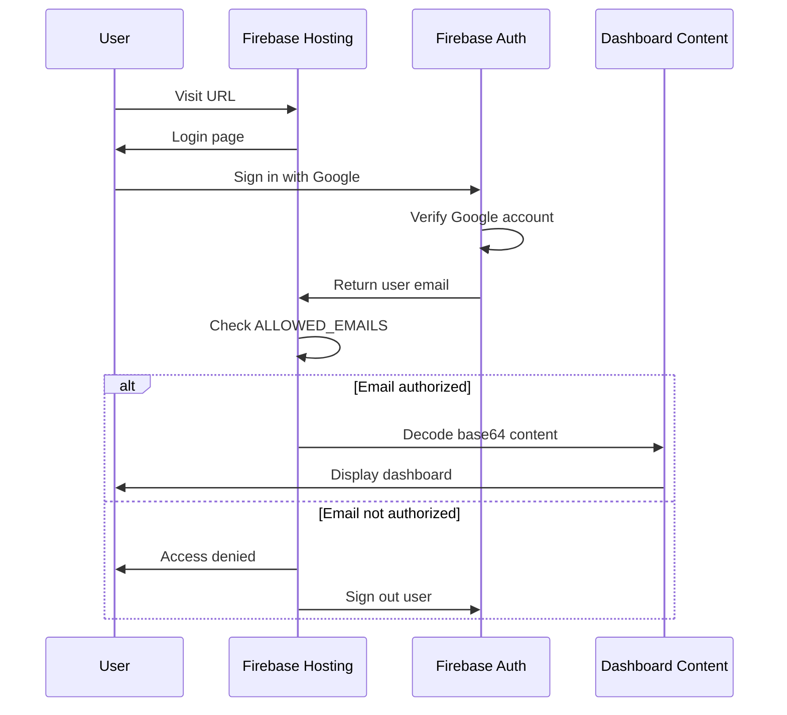

# Splitwise Expense Dashboard


The analytics Splitwise charges for — plus features it doesn't have — for free.
Track your Splitwise expenses with an interactive dashboard, automatic cloud backups, and monthly email reports.

> *"How much did we actually spend last month?"*  
> *"Which categories are eating our budget?"*  
> *"Can I get a monthly report in my inbox?"*

## Overview

This application connects to your Splitwise account, fetches your expense history, and generates:

- **Interactive Web Dashboard** — Live, auth-protected dashboard hosted on Firebase
- **Complete Data Backup** — JSON and CSV files backed up to Google Drive
- **Email Reports** — Monthly summaries with a link to the live dashboard

---

## Architecture



### Data Flow

| Step | Action | Output |
|------|--------|--------|
| 1 | Fetch expenses from Splitwise (or cache) | Raw DataFrame with all records |
| 2 | Process data for dashboard | Filtered DataFrame (expenses only) |
| 3 | Calculate statistics | Monthly summary, trends, top categories |
| 4 | Generate HTML dashboard | Interactive Plotly charts + data table |
| 5 | Upload to Google Drive | `expenses.json`, `expenses.csv`, `expenses_dashboard.html` |
| 6 | Deploy to Firebase | Dashboard embedded in auth-protected page |
| 7 | Send email (if `--email`) | Summary with Firebase URL |

### Deployment Behavior

Each script run **completely replaces** the previously deployed dashboard:

1. New dashboard HTML is generated with current data
2. Dashboard is base64-encoded and embedded in `index.html`
3. Firebase deploys the new `index.html`, overwriting the previous version
4. Old dashboard is no longer accessible — only the latest version exists

This ensures:
- No stale data accumulates on Firebase
- Recipients always see the most recent dashboard
- Storage usage remains constant (single deployment)

---

## Security Model

### Authentication Flow



### Security Layers

| Layer | Protection | Implementation |
|-------|------------|----------------|
| **Authentication** | Google OAuth required | Firebase Authentication |
| **Authorization** | Email allowlist | `ALLOWED_EMAILS` array in deployed HTML |
| **Data Protection** | Dashboard not directly accessible | Base64 encoded, embedded in auth page |
| **No Direct URL** | `dashboard.html` doesn't exist | Single `index.html` with embedded content |
| **Secrets** | API keys never exposed | Environment variables / GitHub Secrets |
| **Transport** | HTTPS enforced | Firebase Hosting default |

### What's Protected

| Asset | Location | Access Control |
|-------|----------|----------------|
| Live dashboard | Firebase (`index.html`) | Google Auth + email allowlist |
| Backup files | Google Drive | Private folder (only owner) |
| Expense data | Embedded in HTML | Requires auth to decode/view |
| API credentials | GitHub Secrets / `.env` | Never in code or logs |

### Limitations

| Scenario | Risk Level | Notes |
|----------|------------|-------|
| Page source after auth | Low | Dashboard is base64-encoded but decodable |
| Firebase project access | Low | Requires Google Cloud project permissions |
| Google Drive backup | Low | Private unless explicitly shared |

---

## Getting Started

### Prerequisites

- Python 3.11 or higher
- Node.js 18+ (for Firebase CLI)
- A [Splitwise](https://www.splitwise.com) account with expenses

### Installation

**1. Clone this repository**

```bash
git clone https://github.com/mduse88/family_expenses.git
cd family_expenses
```

**2. Create a virtual environment and install dependencies**

```bash
python3 -m venv venv
source venv/bin/activate  # On Windows: venv\Scripts\activate
pip install -r Requirements.txt
```

**3. Get your Splitwise API key**

1. Visit [Splitwise Apps](https://secure.splitwise.com/apps) and register a new application
2. Copy the **API Key** (see [Splitwise API Key](#splitwise-api-key-required) for detailed steps)

**4. Configure your credentials**

```bash
cp .env.example .env
```

Open `.env` in a text editor and add your API key:

```env
# Required
api_key=YOUR_SPLITWISE_API_KEY

# Optional: limit to a specific Splitwise group
group_id=YOUR_GROUP_ID

# Optional: customize the dashboard title
DASHBOARD_TITLE=My Family Expenses
```

**5. Generate your dashboard**

```bash
python family_expenses.py --local
```

This creates three files in the `output/` folder:

| File | Description |
|------|-------------|
| `YYYY-MM-DD_expenses.json` | Complete backup of all Splitwise data |
| `YYYY-MM-DD_expenses.csv` | Same data in spreadsheet format |
| `YYYY-MM-DD_expenses_dashboard.html` | Interactive dashboard |

**6. Open the dashboard**

```bash
open output/*_expenses_dashboard.html
```

You should see your expenses displayed with charts, filters, and a monthly summary.

### Optional: Cloud Backup & Email Reports

To enable automatic Google Drive backups and email reports:

1. Set up [Google Drive OAuth](#google-drive-oauth-for-cloud-backup) credentials
2. Set up a [Gmail App Password](#gmail-app-password-for-email-automation)
3. Run with additional flags:

```bash
# Upload to Google Drive
python family_expenses.py

# Upload and send email report
python family_expenses.py --email
```

### Optional: Automated Monthly Reports

Set up GitHub Actions to run automatically on the 1st of each month. See [GitHub Actions Automation](#github-actions-automation) for setup instructions.

---

## Features

| Feature | Description |
|---------|-------------|
| **Live Web Dashboard** | Auth-protected dashboard on Firebase with charts, filters, and search |
| **Complete Data Backup** | JSON and CSV exports with all Splitwise fields (payments, users, repayments) |
| **Full History Retrieval** | Fetches all expenses from your first to your most recent via automatic pagination |
| **Email Reports** | Monthly summary with spending trends, top categories, and a link to the live dashboard |
| **Google Drive Backup** | Automatic cloud backup of all expense data |
| **Google Authentication** | Only authorized emails can access the dashboard |
| **CSV Export** | Download filtered data directly from the dashboard |

---

## Project Structure

```
├── family_expenses.py          # Main CLI entry point
├── src/
│   ├── config.py               # Environment configuration loader
│   ├── splitwise_client.py     # Splitwise API integration + pagination
│   ├── dashboard.py            # HTML dashboard generator (Jinja2)
│   ├── email_sender.py         # Gmail SMTP email sender
│   ├── gdrive.py               # Google Drive OAuth upload/download
│   ├── firebase.py             # Firebase Hosting deployment
│   └── stats.py                # Monthly statistics calculations
├── templates/
│   └── dashboard.html          # Dashboard Jinja2 template
├── firebase_public/
│   └── index.html              # Auth gate with placeholders
├── .github/workflows/
│   └── expense_report.yml      # GitHub Actions automation
├── firebase.json               # Firebase Hosting config
├── .firebaserc                  # Firebase project binding
└── Requirements.txt            # Python dependencies
```

### Module Responsibilities

| Module | Purpose |
|--------|---------|
| `family_expenses.py` | CLI parsing, orchestration, temp file management |
| `splitwise_client.py` | API connection, pagination, data serialization |
| `dashboard.py` | Jinja2 template rendering with Plotly charts |
| `stats.py` | Monthly totals, averages, trends, top categories |
| `gdrive.py` | OAuth token refresh, file upload/download, sharing |
| `firebase.py` | Base64 encoding, placeholder injection, CLI deploy |
| `email_sender.py` | HTML email composition, SMTP send |

---

## Configuration Details

This section provides detailed setup instructions for each integration.

### Splitwise API Key (Required)

<details>
<summary>How to get your Splitwise API Key</summary>

1. Go to [Splitwise Apps](https://secure.splitwise.com/apps)
2. Click **Register your application**
3. Fill in the form:
   - Application name: `Expense Dashboard`
   - Description: `Personal expense tracking`
   - Homepage URL: `https://github.com`
4. Click **Register and get API key**
5. Copy the **API Key** (not the Consumer Key/Secret)

**Finding your Group ID** (optional):

Open Splitwise in your browser, navigate to your group, and copy the number from the URL:
`https://www.splitwise.com/groups/XXXXXXX` → `XXXXXXX` is your Group ID

</details>

### Gmail App Password (Optional)

<details>
<summary>How to create a Gmail App Password</summary>

> **Requirement:** 2-Step Verification must be enabled on your Google Account.

1. Go to [Google Account Security](https://myaccount.google.com/security)
2. Under "Signing in to Google", click **2-Step Verification**
3. Scroll down and click **App passwords**
4. Select app: **Mail**
5. Select device: **Other (Custom name)** → Enter `Expense Dashboard`
6. Click **Generate**
7. Copy the 16-character password

> **Note:** Store this password securely — you cannot view it again.

</details>

### Firebase Hosting (Required for Email Reports)

<details>
<summary>How to set up Firebase Hosting</summary>

Firebase Hosting serves your dashboard as a live web page with Google authentication, so only authorized family members can access it.

**Step 1: Create a Firebase Project**

1. Go to [Firebase Console](https://console.firebase.google.com/)
2. Click **Add project** (or select your existing Google Cloud project)
3. Follow the setup wizard
4. Navigate to **Build** → **Hosting** and click **Get started**
5. Navigate to **Build** → **Authentication**, enable it, and add **Google** as a sign-in provider

**Step 2: Install Firebase CLI**

```bash
npm install -g firebase-tools
```

**Step 3: Login and Initialize**

```bash
firebase login
firebase init hosting
```

When prompted:
- Select your Firebase project
- Set public directory to: `firebase_public`
- Single-page app: **No**
- Overwrite index.html: **No** (keep the auth gate)

**Step 4: Generate CI Token (for GitHub Actions)**

```bash
firebase login:ci
```

Copy the token and add it as `FIREBASE_TOKEN` in your GitHub Secrets.

**Step 5: Test Deployment**

```bash
firebase deploy --only hosting
```

Your dashboard will be available at `https://YOUR-PROJECT.web.app`

</details>

### Google Drive OAuth (For Backups)

<details>
<summary>How to set up Google Drive OAuth</summary>

**Step 1: Create a Google Cloud Project**

1. Go to [Google Cloud Console](https://console.cloud.google.com/)
2. Create a new project or select an existing one
3. Navigate to **APIs & Services** → **Library**
4. Search for **Google Drive API** and enable it

**Step 2: Configure OAuth Consent Screen**

1. Go to **APIs & Services** → **OAuth consent screen**
2. Select **External** user type
3. Fill in required fields (App name, support email, developer contact)
4. On the Scopes page, add: `https://www.googleapis.com/auth/drive.file`
5. Complete the remaining steps

**Step 3: Create OAuth Credentials**

1. Go to **APIs & Services** → **Credentials**
2. Click **Create Credentials** → **OAuth client ID**
3. Select **Desktop app** as the application type
4. Download the JSON credentials file

**Step 4: Generate Refresh Token**

Run the included helper script:

```bash
python get_gdrive_token.py path/to/credentials.json
```

This opens a browser for authentication and outputs your `GDRIVE_CLIENT_ID`, `GDRIVE_CLIENT_SECRET`, and `GDRIVE_REFRESH_TOKEN`.

**Step 5: Create a Backup Folder**

1. Create a folder in [Google Drive](https://drive.google.com)
2. Copy the folder ID from the URL: `drive.google.com/drive/folders/FOLDER_ID`

</details>

---

## Environment Variables

Create a `.env` file in the project root with the following variables:

```env
# Branding (optional)
DASHBOARD_TITLE=Family Expenses

# Splitwise (required)
api_key=your_splitwise_api_key
group_id=your_group_id  # Optional: if omitted, fetches from ALL groups

# Google Drive (optional for local use)
GDRIVE_CLIENT_ID=your_client_id
GDRIVE_CLIENT_SECRET=your_client_secret
GDRIVE_REFRESH_TOKEN=your_refresh_token
GDRIVE_FOLDER_ID=your_folder_id

# Email (optional for local use)
GMAIL_ADDRESS=your_email@gmail.com
GMAIL_APP_PASSWORD=your_16_char_password
RECIPIENT_EMAIL=recipient1@email.com,recipient2@email.com
```

| Variable | Required | Description |
|----------|----------|-------------|
| `DASHBOARD_TITLE` | No | Custom title for the dashboard |
| `api_key` | **Yes** | Splitwise API Key |
| `group_id` | No | Splitwise Group ID (omit to fetch from all groups) |
| `GDRIVE_*` | No | Google Drive OAuth credentials |
| `GMAIL_*` | No | Gmail credentials for email automation |

### Command Reference

| Command | Description |
|---------|-------------|
| `python family_expenses.py` | Fetch fresh data from Splitwise, upload to Google Drive |
| `python family_expenses.py --email` | Same as above, plus send an email report |
| `python family_expenses.py --local` | Use cached data, save to `output/`, upload to Google Drive |
| `python family_expenses.py --local --email` | Same as above, plus send an email report |
| `python family_expenses.py --full-log` | Enable verbose logging for troubleshooting |

You can combine flags: `python family_expenses.py --local --email --full-log`

### CLI Flags

| Flag | Default | Description |
|------|---------|-------------|
| `--local` | off | Use cached data (Drive → output/ → API) and save files to `output/` |
| `--email` | off | Send email summary with Firebase dashboard link |
| `--full-log` | off | Enable verbose logging |

**Google Drive upload** always happens when configured (for backup).
**Firebase deployment** always happens (dashboard accessible at your Firebase URL).

### Local Mode (`--local`)

The `--local` flag affects two things:

1. **Data source**: Uses cached data instead of fetching fresh from Splitwise
2. **File storage**: Saves files to `output/` folder (in addition to uploading to Drive)

**Data source priority** (when `--local` is used):

1. Google Drive cache (most recent `*_expenses.json`)
2. Local `output/` folder cache
3. Splitwise API (only if no cache exists)

**Output files** are saved to `output/` with a date prefix:

```
output/
├── 2025-12-15_expenses.json
├── 2025-12-15_expenses.csv
└── 2025-12-15_expenses_dashboard.html
```

Files with the same date are automatically replaced.

---

## GitHub Actions Automation

This repository includes a GitHub Actions workflow that runs automatically on the 1st of each month at 8:00 AM CET.

**What the workflow does:**

```
1. Checkout code
2. Set up Python 3.11 + Node.js 20
3. Install Firebase CLI (npm install -g firebase-tools)
4. Install Python dependencies (pip install -r Requirements.txt)
5. Run: python family_expenses.py --email
   ├── Fetch all expenses from Splitwise API
   ├── Generate dashboard with monthly statistics
   ├── Upload backup files to Google Drive
   ├── Deploy dashboard to Firebase Hosting
   └── Send email with Firebase URL
```

**Execution time:** ~2-3 minutes (depending on expense count)

### Running Manually

You can trigger the workflow at any time:

1. Go to **Actions** → **Monthly Expense Report** → **Run workflow**
2. Configure options:
   - **Send email notification** — enabled by default
3. Click **Run workflow**

> **Tip:** Disable email notification when testing to avoid unnecessary emails.

### GitHub Secrets

Navigate to **Settings** → **Secrets and variables** → **Actions** → **Secrets** tab:

| Secret | Required | Description |
|--------|----------|-------------|
| `SPLITWISE_API_KEY` | Yes | Your Splitwise API Key |
| `SPLITWISE_GROUP_ID` | No | Splitwise Group ID (omit to fetch all groups) |
| `GMAIL_ADDRESS` | For email | Gmail sender address |
| `GMAIL_APP_PASSWORD` | For email | Gmail App Password (16 characters) |
| `GDRIVE_CLIENT_ID` | For backup | Google OAuth Client ID |
| `GDRIVE_CLIENT_SECRET` | For backup | Google OAuth Client Secret |
| `GDRIVE_REFRESH_TOKEN` | For backup | Google OAuth Refresh Token |
| `GDRIVE_FOLDER_ID` | For backup | Google Drive folder ID |
| `FIREBASE_TOKEN` | For hosting | Firebase CI token (from `firebase login:ci`) |

### GitHub Variables

Navigate to **Settings** → **Secrets and variables** → **Actions** → **Variables** tab:

| Variable | Required | Description |
|----------|----------|-------------|
| `RECIPIENT_EMAIL` | For email | Comma-separated email addresses |
| `DASHBOARD_TITLE` | No | Custom dashboard title |

---

## Output Files

Each run generates three files with a date prefix (e.g., `2025-12-15`):

| File | Description |
|------|-------------|
| `*_expenses.json` | Complete backup — all Splitwise records with full details |
| `*_expenses.csv` | Complete backup — same data in spreadsheet format |
| `*_expenses_dashboard.html` | Interactive dashboard — expenses only, optimized for visualization |

### What's Included

**JSON/CSV backups** contain all Splitwise data:
- Expenses and payment settlements
- Full record details: `id`, `description`, `cost`, `date`, `category`, `repayments`, `users`, etc.

**HTML dashboard** contains:
- Expenses only (payments excluded)
- Fields needed for charts and filtering: `date`, `description`, `cost`, `category_name`

### Monthly Statistics

The dashboard and email reports include:

| Metric | Description |
|--------|-------------|
| **Last Month Total** | Sum of expenses in the most recent complete month |
| **Monthly Average** | Average across all months (including months with no expenses) |
| **Trend** | Percentage change compared to your average |
| **Top Categories** | Highest spending categories with individual trends |

---

## Troubleshooting

| Error | Solution |
|-------|----------|
| "Missing api_key environment variable" | Ensure `.env` exists and contains `api_key=YOUR_KEY`. Verify at [Splitwise Apps](https://secure.splitwise.com/apps). |
| "Email not configured" | All three variables required: `GMAIL_ADDRESS`, `GMAIL_APP_PASSWORD`, `RECIPIENT_EMAIL`. App password must be 16 characters. |
| "Failed to upload to Google Drive" | Verify all `GDRIVE_*` variables are set. Run `get_gdrive_token.py` to refresh expired tokens. |
| Dashboard shows no data | Check `group_id` is correct, or remove it to fetch from all groups. |

For detailed logs, run with `--full-log`:
```bash
python family_expenses.py --local --full-log
```

---

## Contributing

Contributions are welcome. Please open an issue to discuss changes before submitting a pull request.

## License

This project is provided as-is under the MIT License.
